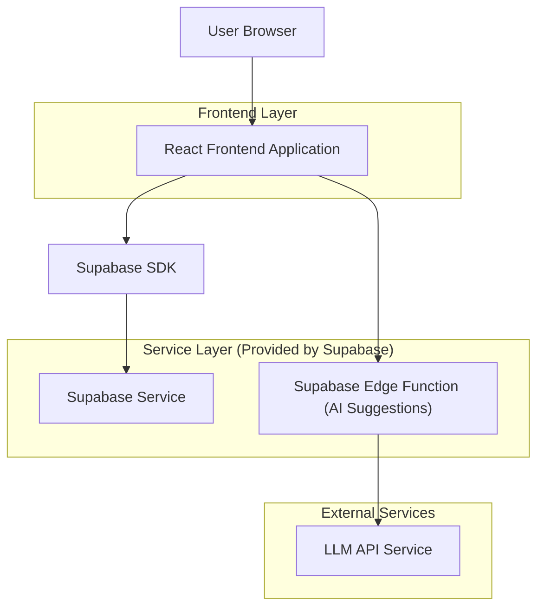
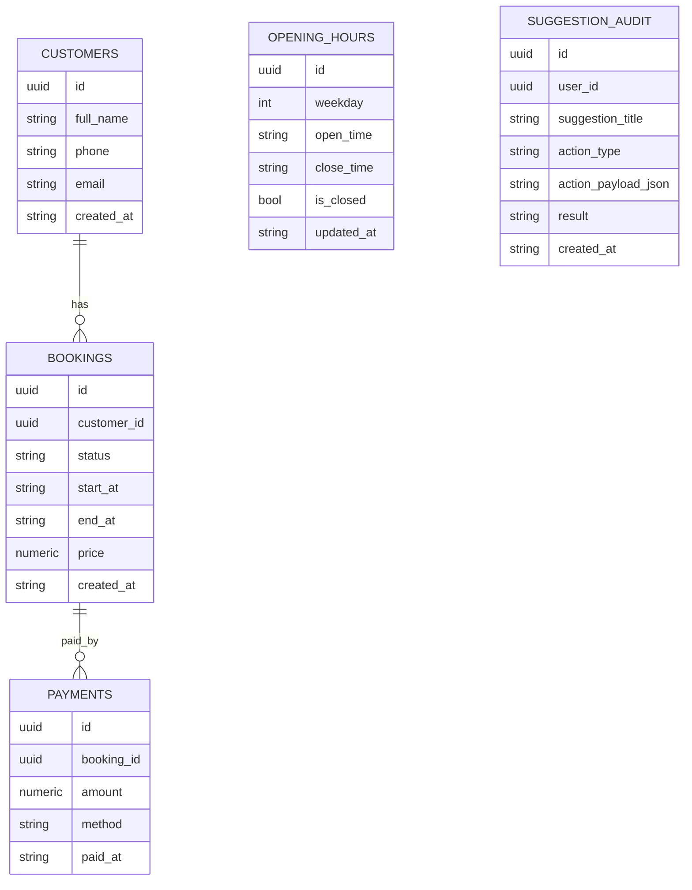

## 1.Architecture design



## 2.Technology Description

- Frontend: React\@18 + vite + tailwindcss\@3
- Backend: Supabase (Auth + PostgreSQL + Realtime + Edge Functions)

## 3.Route definitions

| Route            | Purpose                                                   |
| ---------------- | --------------------------------------------------------- |
| /login           | Accesso e creazione sessione utente                       |
| /                | Dashboard AI: KPI + suggerimenti + refresh                |
| /suggestions/:id | Dettaglio suggerimento, evidenze e applicazione one‑click |
| /settings        | Parametri analisi, preferenze aggiornamento, audit        |

## 4.API definitions (If it includes backend services)

### 4.1 Edge Function: Generazione suggerimenti

```
POST /functions/v1/generate-suggestions
```

TypeScript (shared)

```ts
export type KpiSnapshot = {
  rangeDays: number;
  fromISO: string;
  toISO: string;
  bookingsCount: number;
  cancellationsCount: number;
  noShowCount: number;
  uniqueCustomers: number;
  returningCustomers: number;
  totalRevenue: number;
  avgTicket: number;
  occupancyRate: number; // 0..1
};

export type SuggestionActionType =
  | "ADJUST_OPENING_HOURS"
  | "ADJUST_CAPACITY"
  | "SEND_CUSTOMER_MESSAGE"
  | "APPLY_PRICING_RULE"
  | "ENABLE_DEPOSIT";

export type Suggestion = {
  id: string;
  title: string;
  explanation: string; // testo chiaro e “perché”
  evidence: string[];  // bullet di evidenze/dati
  expectedImpact: string; // es. +X% ricavi, -Y% no-show (stimato)
  action: {
    type: SuggestionActionType;
    payload: Record<string, unknown>; // parametri per l’applicazione
    isReversible: boolean;
  };
  priority: "HIGH" | "MEDIUM" | "LOW";
};

export type GenerateSuggestionsRequest = {
  kpis: KpiSnapshot;
};

export type GenerateSuggestionsResponse = {
  suggestions: Suggestion[];
  generatedAtISO: string;
};
```

Request:

| Param Name | Param Type  | isRequired | Description                                                        |
| ---------- | ----------- | ---------- | ------------------------------------------------------------------ |
| kpis       | KpiSnapshot | true       | KPI aggregati calcolati da dati prenotazioni/clienti/orari/incassi |

Response:

| Param Name     | Param Type    | Description                              |
| -------------- | ------------- | ---------------------------------------- |
| suggestions    | Suggestion\[] | Lista suggerimenti spiegati e attivabili |
| generatedAtISO | string        | Timestamp generazione                    |

Note sicurezza:

- La Edge Function conserva la chiave LLM in variabili d’ambiente (secret), mai nel frontend.

## 6.Data model(if applicable)

### 6.1 Data model definition



### 6.2 Data Definition Language

Bookings (bookings)

```sql
CREATE TABLE bookings (
  id UUID PRIMARY KEY DEFAULT gen_random_uuid(),
  customer_id UUID NOT NULL,
  status VARCHAR(30) NOT NULL, -- es: confirmed/cancelled/no_show/completed
  start_at TIMESTAMP WITH TIME ZONE NOT NULL,
  end_at TIMESTAMP WITH TIME ZONE NOT NULL,
  price NUMERIC(12,2) NOT NULL DEFAULT 0,
  created_at TIMESTAMP WITH TIME ZONE DEFAULT NOW()
);

CREATE INDEX idx_bookings_start_at ON bookings(start_at);
CREATE INDEX idx_bookings_customer_id ON bookings(customer_id);

GRANT SELECT ON bookings TO anon;
GRANT ALL PRIVILEGES ON bookings TO authenticated;
```

Customers (customers)

```sql
CREATE TABLE customers (
  id UUID PRIMARY KEY DEFAULT gen_random_uuid(),
  full_name VARCHAR(200) NOT NULL,
  phone VARCHAR(50),
  email VARCHAR(255),
  created_at TIMESTAMP WITH TIME ZONE DEFAULT NOW()
);

CREATE INDEX idx_customers_email ON customers(email);

GRANT SELECT ON customers TO anon;
GRANT ALL PRIVILEGES ON customers TO authenticated;
```

Opening hours (opening\_hours)

```sql
CREATE TABLE opening_hours (
  id UUID PRIMARY KEY DEFAULT gen_random_uuid(),
  weekday INT NOT NULL CHECK (weekday BETWEEN 0 AND 6),
  open_time TIME,
  close_time TIME,
  is_closed BOOLEAN NOT NULL DEFAULT FALSE,
  updated_at TIMESTAMP WITH TIME ZONE DEFAULT NOW()
);

CREATE INDEX idx_opening_hours_weekday ON opening_hours(weekday);

GRANT SELECT ON opening_hours TO anon;
GRANT ALL PRIVILEGES ON opening_hours TO authenticated;
```

Payments (payments)

```sql
CREATE TABLE payments (
  id UUID PRIMARY KEY DEFAULT gen_random_uuid(),
  booking_id UUID NOT NULL,
  amount NUMERIC(12,2) NOT NULL,
  method VARCHAR(30),
  paid_at TIMESTAMP WITH TIME ZONE
);

CREATE INDEX idx_payments_booking_id ON payments(booking_id);

GRANT SELECT ON payments TO anon;
GRANT ALL PRIVILEGES ON payments TO authenticated;
```

Suggestion audit (suggestion\_audit)

```sql
CREATE TABLE suggestion_audit (
  id UUID PRIMARY KEY DEFAULT gen_random_uuid(),
  user_id UUID NOT NULL,
  suggestion_title VARCHAR(200) NOT NULL,
  action_type VARCHAR(50) NOT NULL,
  action_payload_json JSONB NOT NULL,
  result VARCHAR(20) NOT NULL, -- success/fail
  created_at TIMESTAMP WITH TIME ZONE DEFAULT NOW()
);

CREATE INDEX idx_suggestion_audit_created_at ON suggestion_audit(created_at DESC);

GRANT SELECT ON suggestion_audit TO anon;
GRANT ALL PRIVILEGES ON suggestion_audit TO authenticated;
```

