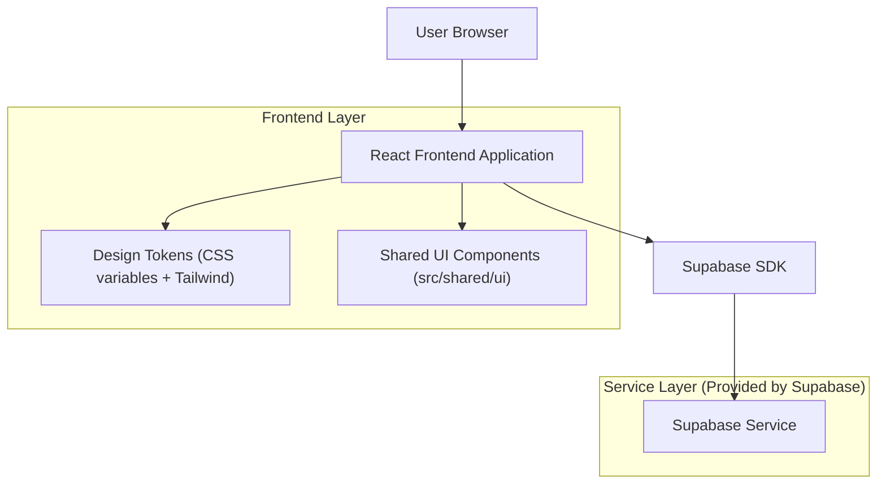

## 1.Architecture design

## 2.Technology Description
- Frontend: React + TypeScript + react-router-dom + tailwindcss + vite
- Backend: API Node/Express (solo per integrazioni server, es. Stripe/notifications), Supabase per Auth/DB
- UI system: CSS variables + classi `.tb-*` in `src/index.css` + componenti in `src/shared/ui/`

## 3.Route definitions
| Route | Purpose |
|-------|---------|
| /start | Entry/landing con CTA verso login e ruolo |
| /login | Autenticazione |
| /reset-password | Recupero password |
| /esplora | Ricerca attività (mappa + lista + filtri) |
| /attivita/:id | Dettaglio attività + prenotazione |
| /prenotazioni | Area cliente: stati prenotazioni, caparra, chat |
| /dashboard-cliente | Sintesi cliente (se usata) |
| /dashboard-attivita | Area attività: operatività e gestione prenotazioni |
| /onboarding-attivita | Setup guidato attività |
| /pagamenti-attivita | Pagamenti e rendicontazione |
| /profilo | Profilo utente |
| /impostazioni | Preferenze/impostazioni |
| /notifiche | Centro notifiche |

## 4.API definitions (If it includes backend services)
Nessuna nuova API richiesta per il piano UI/UX premium (intervento su token, componenti e layout).

## 6.Data model(if applicable)
Nessun cambiamento al modello dati richiesto (refactor solo di presentazione e stati UI).