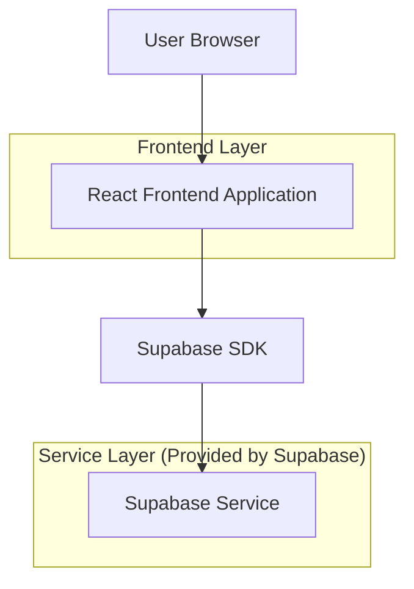
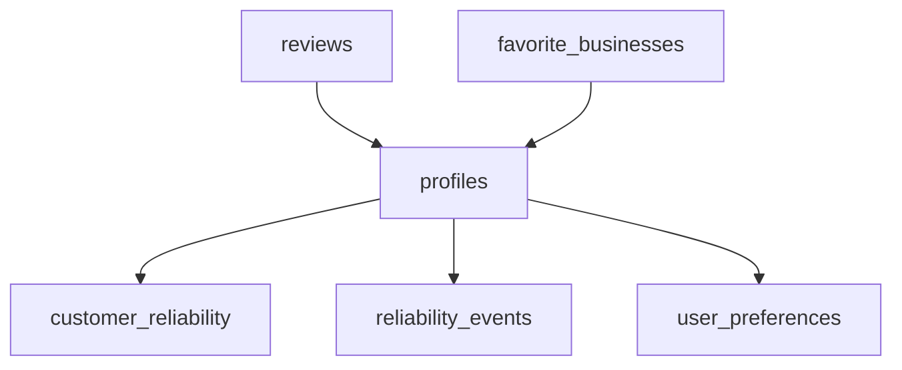

## 1.Architecture design


## 2.Technology Description
- Frontend: React@18 + react-router-dom + tailwindcss@3 + vite
- Backend: Supabase (Auth + Postgres + Realtime + Storage)

## 3.Route definitions
| Route | Purpose |
|---|---|
| /profilo | Profilo cliente con reputazione, recensioni, preferiti e modifica dati |
| /impostazioni | Preferenze privacy, notifiche e sicurezza account (nuova pagina) |
| /notifiche | Inbox notifiche (già presente) |
| /reset-password | Recupero password (già presente) |

## 6.Data model(if applicable)

### 6.1 Data model definition
**Esistente (usato da Profilo):** profiles, customer_reliability, reliability_events, reviews, favorite_businesses.

**Nuovo (minimo per redesign premium):**
- user_preferences: salva privacy/notifiche/sicurezza (solo preferenze UI, non credenziali).



### 6.2 Data Definition Language
User Preferences (user_preferences)
```
CREATE TABLE IF NOT EXISTS user_preferences (
  user_id uuid PRIMARY KEY,

  -- privacy
  profile_visibility text NOT NULL DEFAULT 'private' CHECK (profile_visibility IN ('private','public')),
  location_sharing text NOT NULL DEFAULT 'off' CHECK (location_sharing IN ('off','city','precise')),

  -- notifiche: categorie
  notif_booking boolean NOT NULL DEFAULT true,
  notif_deposit boolean NOT NULL DEFAULT true,
  notif_messages boolean NOT NULL DEFAULT true,
  notif_marketing boolean NOT NULL DEFAULT false,

  -- notifiche: canali
  channel_in_app boolean NOT NULL DEFAULT true,
  channel_email boolean NOT NULL DEFAULT true,

  updated_at timestamptz NOT NULL DEFAULT now()
);

ALTER TABLE user_preferences ENABLE ROW LEVEL SECURITY;

-- RLS: solo il proprietario può leggere/scrivere
DROP POLICY IF EXISTS user_preferences_select_own ON user_preferences;
CREATE POLICY user_preferences_select_own ON user_preferences
FOR SELECT TO authenticated
USING (user_id = auth.uid());

DROP POLICY IF EXISTS user_preferences_upsert_own ON user_preferences;
CREATE POLICY user_preferences_upsert_own ON user_preferences
FOR ALL TO authenticated
USING (user_id = auth.uid())
WITH CHECK (user_id = auth.uid());

-- Permessi: nessun accesso anon
REVOKE ALL ON user_preferences FROM anon;
GRANT ALL PRIVILEGES ON user_preferences TO authenticated;
```
