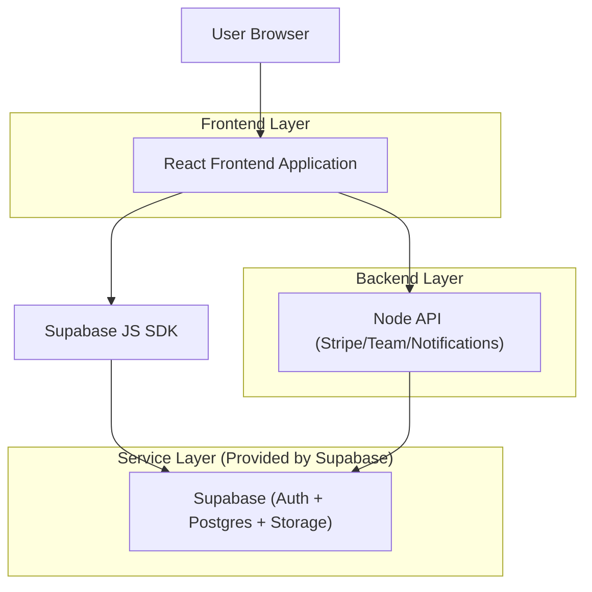
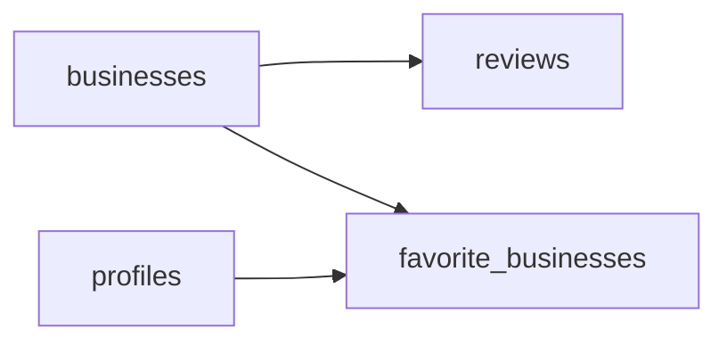

## 1.Architecture design


## 2.Technology Description
- Frontend: React@18 + TypeScript + tailwindcss@3 + vite
- Backend: Node.js (API esistente) + @supabase/supabase-js (solo per operazioni privilegiate lato server, es. admin)
- Database: Supabase (PostgreSQL)

## 3.Route definitions
| Route | Purpose |
|-------|---------|
| /esplora | Lista attività con ricerca/filtri/ordinamento + mappa |
| /attivita/:id | Dettaglio attività (entry point dalla scoperta) |
| /dashboard-attivita | Area attività; include liste operative con filtri/ricerca |
| /prenotazioni | Lista prenotazioni cliente (contesto post-scoperta) |

## 4.API definitions (If it includes backend services)
Per il redesign di search/discovery non è richiesto un nuovo backend: la pagina può interrogare Supabase direttamente via SDK con query server-side (filtri/sort/paginazione).

Tipi condivisi (concettuali):
```ts
export type SortKey = 'relevance' | 'distance' | 'rating' | 'newest'

export type SearchState = {
  q: string
  filters: {
    category?: string
    maxDistanceKm?: number
    hasLocation?: boolean
  }
  sort: SortKey
  page: number
}
```

## 6.Data model(if applicable)
### 6.1 Data model definition


### 6.2 Data Definition Language
Indici consigliati per performance (quando dataset cresce):
```sql
-- Filter/sort veloci
CREATE INDEX IF NOT EXISTS idx_businesses_category ON businesses (category);
CREATE INDEX IF NOT EXISTS idx_businesses_created_at ON businesses (created_at DESC);

-- Ricerca testuale (opzionale): richiede estensione pg_trgm
-- CREATE EXTENSION IF NOT EXISTS pg_trgm;
-- CREATE INDEX IF NOT EXISTS idx_businesses_name_trgm ON businesses USING gin (name gin_trgm_ops);
-- CREATE INDEX IF NOT EXISTS idx_businesses_city_trgm ON businesses USING gin (city gin_trgm_ops);
```

Linee guida query (frontend):
- Selezionare solo colonne necessarie per card/lista (evitare `select('*')`).
- Debounce input (250–350ms) e annullare richieste in-flight.
- Paginare: `range(from, to)`; mantenere UI “Mostra altri” o pagination compatta.
- Ordinare lato DB quando possibile (newest); calcoli client-side solo se dataset piccolo (es. distanza dopo geolocalizzazione).
