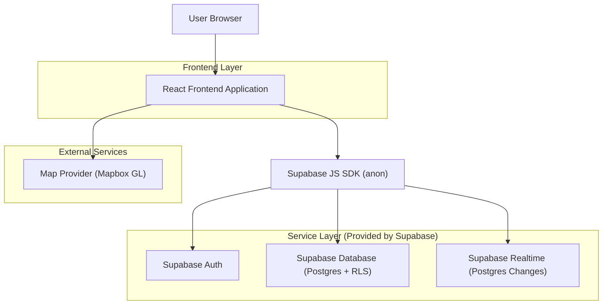
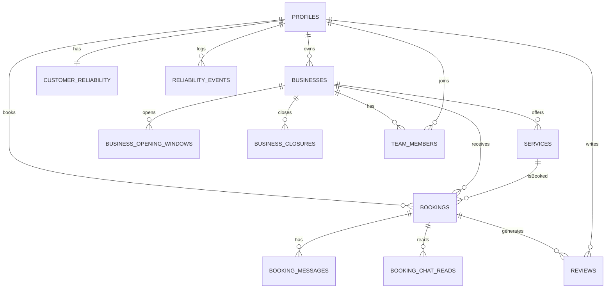

## 1.Architecture design


## 2.Technology Description
- Frontend: React@18 + TypeScript + vite + react-router-dom@7 + tailwindcss@3 + zustand
- Backend: Supabase (Auth, Postgres, RLS policies, Realtime)
- Maps: mapbox-gl (richiede API key)

Note performance:
- Route-level code splitting (lazy load delle pagine principali)
- Mapbox caricato on-demand per ridurre il bundle iniziale

## 3.Route definitions
| Route | Purpose |
|-------|---------|
| /start | Scelta ruolo (cliente/attività) e instradamento a login/registrazione |
| /login | Login/registrazione (creazione profilo utente) |
| / | Entry: Landing pubblica se non autenticato, altrimenti Esplora |
| /attivita/:id | Dettaglio attività + servizi + disponibilità + richiesta prenotazione |
| /prenotazioni | Area Cliente: prenotazioni, caparra, proposte, chat, cancellazione, affidabilità personale, recensioni |
| /dashboard-attivita | Area Attività: onboarding, prenotazioni (approvazioni/proposte/esiti), chat, staff, servizi, orari/ferie, impostazioni policy |

## 4.Data access & security (Supabase RLS)
- Auth: Supabase Auth (email/password). Il frontend usa Supabase JS SDK con sessione utente.
- Autorizzazione: RLS su tutte le tabelle “sensibili”; l’accesso è consentito solo agli utenti coinvolti (cliente) o ai membri del team dell’attività.
- Realtime: abilitato per `booking_messages` e (opz.) aggiornamenti su `bookings` filtrati via RLS.

Esempi permessi di base (da adattare alle tabelle effettive):
```sql
GRANT SELECT ON bookings TO anon;
GRANT ALL PRIVILEGES ON bookings TO authenticated;
```

## 6.Data model(if applicable)

### 6.1 Data model definition


### 6.2 Data Definition Language
Nota: lo schema usa **RLS** (Row Level Security) per autorizzazioni. Qui sotto c’è un “minimo completo” per guidare l’implementazione cliente/attività.

Profili utente (profiles)
```sql
create table if not exists profiles (
  id uuid primary key, -- = auth.users.id
  role text not null check (role in ('customer','business')),
  display_name text,
  phone text,
  created_at timestamptz not null default now(),
  updated_at timestamptz not null default now()
);
```

Attività e servizi (businesses, services)
```sql
create table if not exists businesses (
  id uuid primary key default gen_random_uuid(),
  owner_user_id uuid not null,
  name text not null,
  category text,
  city text,
  address text,
  lat double precision,
  lng double precision,
  cancellation_window_min int not null default 240,
  deposit_enabled boolean not null default false,
  deposit_amount_cents int,
  created_at timestamptz not null default now(),
  updated_at timestamptz not null default now()
);

create table if not exists services (
  id uuid primary key default gen_random_uuid(),
  business_id uuid not null,
  name text not null,
  duration_min int not null,
  price_cents int,
  is_active boolean not null default true,
  created_at timestamptz not null default now(),
  updated_at timestamptz not null default now()
);
```

Orari/ferie (business_opening_windows, business_closures)
```sql
create table if not exists business_opening_windows (
  id uuid primary key default gen_random_uuid(),
  business_id uuid not null,
  weekday int not null check (weekday between 0 and 6),
  start_time time not null,
  end_time time not null
);

create table if not exists business_closures (
  id uuid primary key default gen_random_uuid(),
  business_id uuid not null,
  start_at timestamptz not null,
  end_at timestamptz not null,
  reason text
);
```

Prenotazioni (bookings)
```sql
create table if not exists bookings (
  id uuid primary key default gen_random_uuid(),
  business_id uuid not null,
  service_id uuid not null,
  customer_user_id uuid not null,
  start_at timestamptz not null,
  end_at timestamptz not null,
  booking_status text not null,
  deposit_status text not null default 'not_required',
  deposit_amount_cents int,
  change_proposed_start_at timestamptz,
  change_proposed_end_at timestamptz,
  cancel_reason text,
  created_at timestamptz not null default now(),
  updated_at timestamptz not null default now()
);

-- Stati prenotazione
-- booking_status: draft, requested, pending_approval, change_proposed, pending_deposit, confirmed,
-- rejected, cancelled_by_customer, cancelled_by_business, completed, no_show, late_cancel
-- deposit_status: not_required, required, paid, refunded, forfeited
```

Staff (team_members)
```sql
create table if not exists team_members (
  id uuid primary key default gen_random_uuid(),
  business_id uuid not null,
  user_id uuid not null,
  role text not null check (role in ('owner','staff')),
  created_at timestamptz not null default now(),
  unique (business_id, user_id)
);
```

Chat prenotazione (booking_messages + booking_chat_reads)
```sql
create table if not exists booking_messages (
  id uuid primary key default gen_random_uuid(),
  booking_id uuid not null,
  sender_user_id uuid not null,
  body text not null,
  created_at timestamptz not null default now()
);

create table if not exists booking_chat_reads (
  booking_id uuid not null,
  user_id uuid not null,
  last_read_at timestamptz not null default now(),
  primary key (booking_id, user_id)
);
```

Affidabilità (customer_reliability, reliability_events)
```sql
create table if not exists customer_reliability (
  user_id uuid primary key,
  score int not null default 100,
  updated_at timestamptz not null default now()
);

create table if not exists reliability_events (
  id uuid primary key default gen_random_uuid(),
  user_id uuid not null,
  booking_id uuid,
  event_type text not null, -- completed | no_show | late_cancel | on_time_cancel | ...
  delta int not null,
  note text,
  created_at timestamptz not null default now()
);
```

Recensioni (reviews)
```sql
create type review_direction as enum ('customer_to_business','business_to_customer');

create table if not exists reviews (
  id uuid primary key default gen_random_uuid(),
  booking_id uuid not null,
  business_id uuid not null,
  author_user_id uuid not null,
  direction review_direction not null,
  rating int not null check (rating between 1 and 5),
  comment text,
  created_at timestamptz not null default now()
);
```

Sicurezza / permessi (high level)
- Tutte le pagine sono protette da login; l’accesso ai dati avviene via RLS:
  - bookings: leggibile/aggiornabile solo da partecipanti (cliente) o membri team dell’attività.
  - booking_messages / booking_chat_reads: leggibile/scrivibile solo da partecipanti della prenotazione.
  - team_members: gestibile dall’owner attività; leggibile dal membro.
  - reviews: inseribili solo dall’autore; vincolo univoco consigliato (booking_id, direction, author_user_id).
  - businesses/services/orari/ferie: scrivibili solo da owner (o staff autorizzato, se previsto via ruolo interno).
