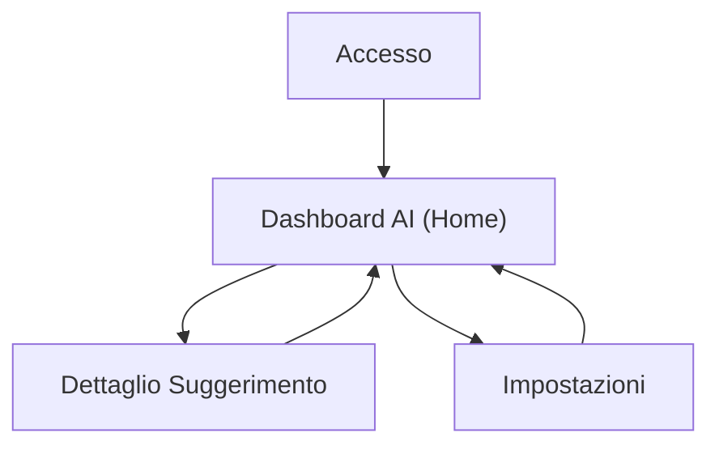

## 1. Product Overview
Sistema di suggerimenti AI per attività con prenotazioni: analizza prenotazioni, clienti, orari e incassi.
Propone azioni spiegate e applicabili con un click, aggiornandosi dinamicamente al variare dei dati.

## 2. Core Features

### 2.1 User Roles
| Role | Registration Method | Core Permissions |
|------|---------------------|------------------|
| Operatore / Manager | Email + password | Vede analisi e suggerimenti; applica suggerimenti one‑click; consulta dati di base |
| Admin | Invito o abilitazione interna | Configura soglie/parametri; gestisce integrazioni dati; controlla audit applicazioni |

### 2.2 Feature Module
Il prodotto è composto dalle seguenti pagine essenziali:
1. **Accesso**: autenticazione utente.
2. **Dashboard AI (Home)**: KPI (prenotazioni/clienti/orari/incassi), lista suggerimenti AI spiegati, aggiornamento dinamico.
3. **Dettaglio Suggerimento**: evidenze e motivazioni, preview impatto, applicazione con un click.
4. **Impostazioni**: parametri di analisi (finestra temporale, soglie), preferenze aggiornamento, log azioni applicate.

### 2.3 Page Details
| Page Name | Module Name | Feature description |
|-----------|-------------|---------------------|
| Accesso | Login | Autenticare con email/password; gestire errori e recupero sessione. |
| Dashboard AI (Home) | KPI & Trend | Mostrare indicatori sintetici su prenotazioni, clienti, orari e incassi; evidenziare variazioni rispetto a periodo precedente. |
| Dashboard AI (Home) | Suggerimenti AI | Elencare suggerimenti ordinati per priorità; mostrare titolo, breve spiegazione, evidenza principale e pulsante “Applica”. |
| Dashboard AI (Home) | Aggiornamento dinamico | Aggiornare KPI e suggerimenti quando cambiano i dati; indicare stato “in aggiornamento” e ultimo aggiornamento. |
| Dettaglio Suggerimento | Spiegazione & Evidenze | Mostrare spiegazione completa, metriche/evidenze usate e condizioni che lo attivano. |
| Dettaglio Suggerimento | Applicazione one‑click | Applicare l’azione proposta con conferma; registrare esito (success/fail) e motivazione in caso di errore. |
| Impostazioni | Parametri analisi | Impostare finestra (es. ultimi 7/30/90 giorni), soglie (occupazione, no‑show, ricavi), e categorie di suggerimenti abilitate. |
| Impostazioni | Preferenze aggiornamento | Scegliere aggiornamento automatico vs manuale; mostrare ultimo refresh e pulsante “Rigenera suggerimenti”. |
| Impostazioni | Audit suggerimenti | Visualizzare elenco azioni applicate (chi/quando/cosa); consentire rollback solo se l’azione è reversibile (se previsto). |

## 3. Core Process
**Flusso Operatore/Manager**
1. Effettui accesso.
2. Visualizzi Dashboard con KPI e suggerimenti aggiornati.
3. Apri un suggerimento per capirne motivazione ed evidenze.
4. Applichi il suggerimento con un click (con conferma).
5. Vedi aggiornarsi KPI/suggerimenti in base ai nuovi dati.

**Flusso Admin**
1. Effettui accesso.
2. Imposti parametri (finestra temporale, soglie) e abiliti/disabiliti categorie.
3. Controlli audit delle applicazioni e stato aggiornamenti.

