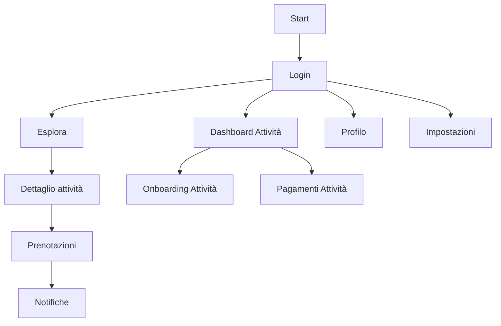

## 1. Product Overview
Rifinitura UI/UX “premium” di TrustBook senza cambiare funzionalità, rendendo l’esperienza più chiara, consistente e accessibile.
Focus: spaziature, tipografia, microcopy, stati hover/focus/disabled/loading, responsive.

## 2. Core Features

### 2.1 User Roles
| Role | Registration Method | Core Permissions |
|------|---------------------|------------------|
| Cliente | Login (Supabase Auth) | Esplora attività, prenota, gestisce caparra/chat/notifiche, profilo/impostazioni |
| Attività | Login (Supabase Auth) | Gestisce dashboard, onboarding attività, pagamenti, regole e prenotazioni |
| Staff (team) | Invito/assegnazione (team_members) | Opera sulla dashboard attività con permessi limitati (se presenti) |

### 2.2 Feature Module
1. **App shell (header + navigazione)**: gerarchia tipografica e spacing coerenti, stati attivi/hover/focus uniformi, densità “desktop-first”.
2. **Accesso (Start, Login, Reset)**: layout più leggibile, microcopy orientato a outcome, errori e stati input standardizzati.
3. **Esplora (mappa + lista)**: grid/padding consistenti, filtri più scansionabili, card risultati con gerarchie e hover “premium”.
4. **Dettaglio attività**: sezioni con spacing standard, CTA primaria unica, microcopy affidabilità/caparra più chiaro.
5. **Prenotazioni & Chat**: timeline/stati prenotazione leggibili, empty/loading consistenti, microcopy di stato (caparra, approvazione, proposte) uniforme.
6. **Dashboard Attività + Pagamenti**: densità informativa controllata, quick actions con stati (busy/confirm), tabelle/card con allineamenti.
7. **Profilo / Impostazioni / Notifiche**: forme e liste uniformi, hover/focus accessibili, microcopy “azioni e conseguenze”.

### 2.3 Page Details
| Page Name | Module Name | Feature description |
|-----------|-------------|---------------------|
| Tutte | Spaziature & layout | Applicare scala spacing 4px (gap/padding) e container coerenti (`max-w-6xl` + `px-4`, `tb-card-pad`), riducendo variazioni non necessarie. |
| Tutte | Tipografia | Standardizzare gerarchie: kicker (`tb-kicker`), titolo (`tb-title`), subtitle (`tb-subtitle`), body/microcopy; limitare “text-xs” non intenzionali. |
| Tutte | Stati interattivi | Uniformare hover/active/focus/disabled/loading per link, button, tab, list-item, card cliccabili; focus sempre visibile e non invasivo. |
| Tutte | Microcopy | Rendere i testi orientati a esito (cosa succede ora), esplicitare condizioni (caparra, attesa approvazione), usare verbi chiari e coerenti. |
| Tutte | Responsive | Desktop-first, poi adattamento: colonne→stack, toolbar→wrap, riduzione densità su <768px, target touch min 44px su mobile. |
| Start | Hero + CTA | Chiarire value prop e CTA primaria; ridurre testo, aumentare respiro verticale, migliorare contrasto secondari. |
| Login/Reset | Form & errori | Label, helper, error e success coerenti (`Alert`), placeholder e microcopy senza ambiguità (“Ti inviamo un link…”). |
| Esplora | Filtri & risultati | Rendere filtri “scansionabili” (chips/segmented), card risultati con hover elevazione/surface; stato “nessun risultato” con `EmptyState`. |
| Dettaglio attività | Sezioni & CTA | Riorganizzare in sezioni (info, disponibilità, regole, affidabilità); CTA primaria fissa/visibile; microcopy caparra semplificato. |
| Prenotazioni | Stati & timeline | Standardizzare badge/tone per stati; timeline leggibile; azioni con conferma; skeleton coerente. |
| Dashboard Attività | Operatività | Evidenziare priorità (richieste/in attesa/proposte); quick actions con busy state; layout a card con griglia. |
| Pagamenti Attività | Tabelle/card | Allineamenti numeri, microcopy commissioni/caparra, empty/loading chiari; filtri data responsive. |
| Profilo/Impostazioni | Forms | Sezioni con titoli brevi, descrizioni `tb-subtitle`, controlli con spacing costante, stati focus/errore uniformi. |
| Notifiche | Lista & azioni | Lista leggibile (densità, separatori), badge count consistente, azioni “segna come letto” con feedback. |

## 3. Core Process
Flusso Cliente: Start/Login → Esplora → Dettaglio attività → Prenota → (eventuale caparra/approvazione/proposta) → Chat/Notifiche → Prenotazioni.
Flusso Attività: Login → (onboarding se necessario) → Dashboard → gestisce richieste/stati → Pagamenti → Impostazioni.

