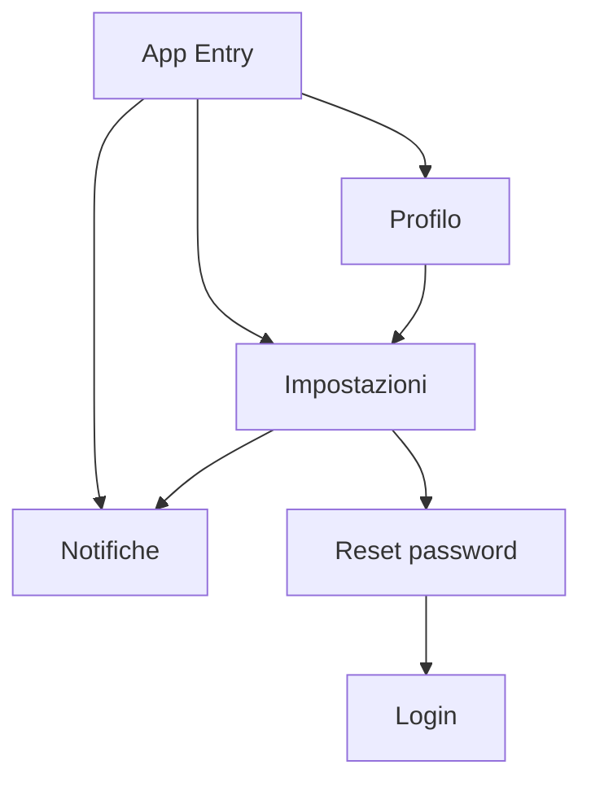

## 1. Product Overview
Redesign premium di **Profilo** e **Impostazioni** per aumentare fiducia, controllo e conversione.
Obiettivo: rendere reputazione, privacy e sicurezza chiare, “actionable” e coerenti.

## 2. Core Features

### 2.1 User Roles
| Role | Registration Method | Core Permissions |
|------|---------------------|------------------|
| Cliente | Email/password (Supabase Auth) | Gestisce profilo, reputazione, preferenze privacy/notifiche/sicurezza |
| Attività (Owner/Staff) | Email/password + onboarding attività | Owner gestisce impostazioni attività; Staff solo lettura dove applicabile |

### 2.2 Feature Module
1. **Profilo**: identità (dati), fiducia/reputazione (score, stelle, breakdown), recensioni, preferiti.
2. **Impostazioni**: privacy, notifiche (preferenze), sicurezza (account, sessione, reset password).
3. **Notifiche**: inbox eventi (booking, caparra, messaggi) + stato letto.

### 2.3 Page Details
| Page Name | Module Name | Feature description |
|---|---|---|
| Profilo | Header identità | Mostrare avatar, nome, ruolo, stato account e CTA “Modifica”/“Salva”. |
| Profilo | Dati personali | Modificare nome, cognome, telefono, città, avatar; validare e salvare. |
| Profilo | Fiducia & Reputazione (premium) | Visualizzare score effettivo, tier (bronzo/argento/oro), rischio, breakdown (boost/penalty), “come migliorare”. |
| Profilo | Timeline reputazione | Elencare ultimi eventi reputazione con delta e data. |
| Profilo | Recensioni ricevute | Elencare recensioni (rating, commento, data, attività). |
| Profilo | Preferiti | Elencare attività salvate e navigare al dettaglio. |
| Impostazioni | Privacy | Configurare visibilità profilo e condivisione posizione (off/città/precisa). |
| Impostazioni | Notifiche (preferenze) | Attivare/disattivare categorie (prenotazioni, caparra, messaggi, promozionali) e canali (in-app/email). |
| Impostazioni | Sicurezza | Avviare reset password, logout, e mostrare segnali di sicurezza (email verificata, ultimo accesso se disponibile). |
| Notifiche | Inbox | Mostrare lista notifiche, real-time, “segna letto” singola/tutte. |

## 3. Core Process
**Cliente – Gestione fiducia:** apri Profilo → leggi score/tier e motivi → consulti eventi → migliori comportamento (es. evitare no-show) → score si aggiorna.

**Cliente – Controllo privacy e notifiche:** apri Impostazioni → scegli visibilità profilo e livello posizione → configuri preferenze notifiche → le notifiche in-app restano consultabili in Notifiche.

**Cliente – Sicurezza account:** apri Impostazioni → avvii reset password o logout → ritorni a Login.

