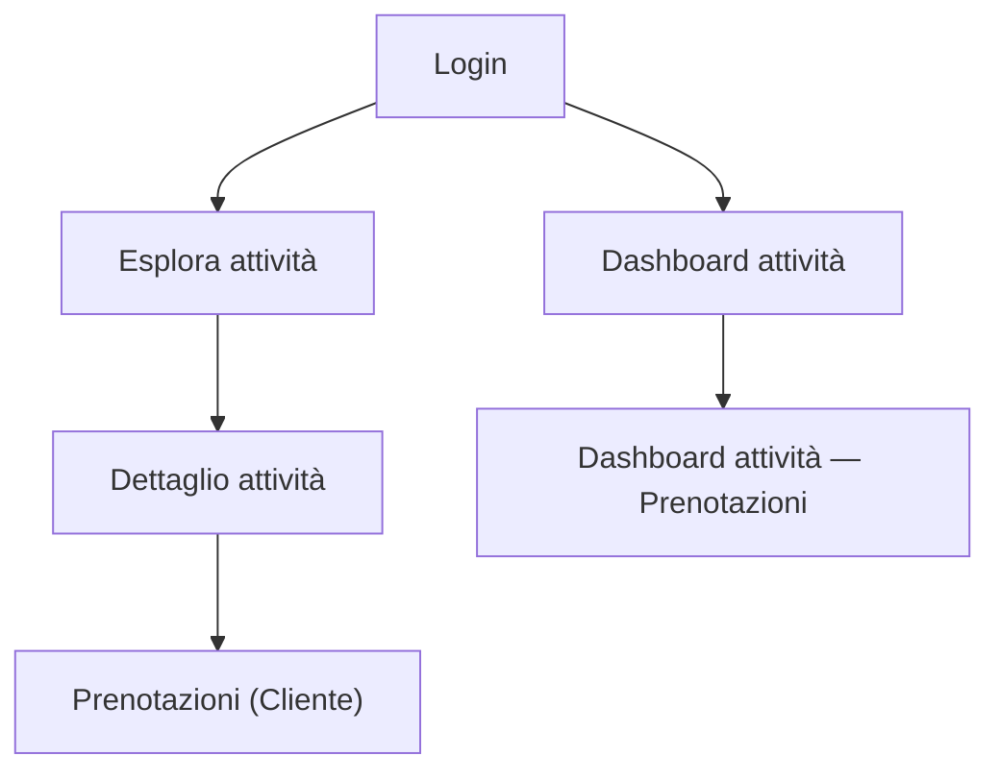

## 1. Product Overview
Redesign coerente col design system di TrustBook per ricerca, filtri, ordinamento e scoperta.
Obiettivo: aumentare trovabilità, chiarezza di stato e performance sulle liste esistenti.

## 2. Core Features

### 2.1 User Roles
| Role | Registration Method | Core Permissions |
|------|---------------------|------------------|
| Cliente | Login/Signup | Esplorare attività, applicare filtri/ordinamento, aprire dettaglio e prenotare |
| Attività | Login/Signup + ruolo “attivita” | Gestire liste operative (prenotazioni, risorse) con filtri/ricerca/ordinamento |

### 2.2 Feature Module
Il redesign si applica alle seguenti pagine esistenti:
1. **Esplora attività**: ricerca testuale, filtri categoria/posizione, ordinamento risultati, moduli scoperta.
2. **Dashboard attività — Prenotazioni**: filtri rapidi per stato, ricerca cliente, ordinamento, indicatori di conteggio.
3. **Pagine gestione (liste)**: pattern riutilizzabile per liste (es. servizi/staff/orari/tag) con ricerca/filtri/sort e stati.

### 2.3 Page Details
| Page Name | Module Name | Feature description |
|-----------|-------------|---------------------|
| Esplora attività | Barra “Search & Sort” | Cercare con input con clear + debounce; mostrare conteggio risultati; offrire select ordinamento. |
| Esplora attività | Filtri (desktop panel + mobile drawer) | Filtrare per categoria; abilitare filtro distanza solo con posizione; mostrare chip filtri attivi + reset. |
| Esplora attività | Scoperta (Suggerimenti) | Offrire shortcut (top categorie, vicino a me, reset) e contenuti “acceleratori” già presenti. |
| Esplora attività | Stati UX (loading/empty/error) | Visualizzare skeleton iniziale; mostrare empty “nessun risultato” con CTA reset; gestire error geolocalizzazione con alert chiaro. |
| Esplora attività | Performance percepita | Ridurre “jank” con aggiornamenti progressivi (typing vs applying); limitare re-render lista e mappa; paginare quando dataset cresce. |
| Dashboard attività — Prenotazioni | Filtri rapidi + ricerca | Filtrare per stato con tab; cercare per nome cliente; mostrare badge conteggi per stato. |
| Dashboard attività — Prenotazioni | Ordinamento | Ordinare per data (prossime/scadute), priorità (in attesa prima), importo caparra (opzionale) mantenendo scelta utente. |
| Dashboard attività — Prenotazioni | Stati UX (loading/empty/error) | Mostrare skeleton righe; empty contestuale per filtro; mantenere query e tab visibili anche in empty. |
| Pagine gestione (liste) | Pattern “List Toolbar” | Cercare per testo; filtrare con chip e drawer; ordinare con select; azione primaria contestuale (es. “Aggiungi”). |
| Pagine gestione (liste) | Empty state guidato | Mostrare empty con spiegazione + CTA primaria; distinguere “nessun dato” vs “nessun match”. |

## 3. Core Process
### Flusso Cliente (Esplora)
1) Apri “Esplora attività”.
2) Digita ricerca (debounce) e/o scegli categoria.
3) (Opzionale) Attiva posizione → sblocca filtro distanza.
4) Seleziona ordinamento (es. Distanza / Valutazione / Novità).
5) Apri un risultato → vai al dettaglio.

### Flusso Attività (Dashboard Prenotazioni)
1) Apri “Dashboard attività”.
2) Scegli tab stato (Oggi / In attesa / …).
3) Cerca cliente per nome.
4) Applica ordinamento (es. prossime prima).
5) Interagisci con la prenotazione (azioni già esistenti).

