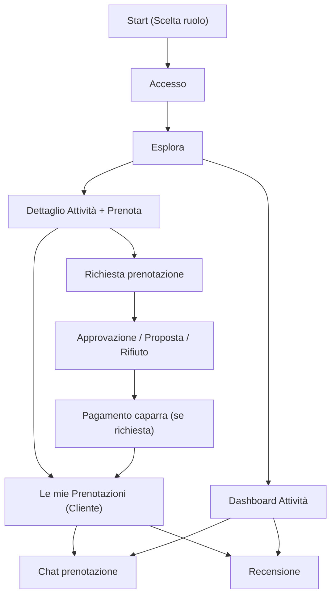

## 1. Product Overview
TrustBook è una piattaforma di prenotazioni essenziale e “activity-first” per Cliente e Attività.
La landing è pubblica (spiega valore e guida alla scelta ruolo); l’area operativa richiede login.
Il core anti no-show è basato su regole chiare: approvazione (anche risk-based), caparra opzionale e reputazione cliente.
Riduce disordine e incomprensioni grazie a stati prenotazione coerenti, chat per singola prenotazione e feedback post-servizio.

## 2. Core Features

### 2.1 User Roles
| Ruolo | Metodo di registrazione | Permessi principali |
|------|--------------------------|---------------------|
| Cliente | Start (scelta ruolo) → registrazione email/password | Esplorare attività, richiedere prenotazioni, pagare/gestire caparra, accettare/rifiutare proposte di cambio orario, chattare per prenotazione, cancellare secondo policy, recensire attività post-servizio, vedere affidabilità personale. |
| Attività (Owner) | Start (scelta ruolo) → registrazione email/password → creazione profilo attività | Gestire profilo attività, servizi, orari/ferie; ricevere richieste, approvare/rifiutare/proporre cambio; gestire stati caparra/no-show; chattare per prenotazione; recensire clienti; gestire staff (team). |
| Staff (membro team) | Aggiunto dall’Owner nell’attività (utente già registrato) | Vedere e gestire prenotazioni dell’attività (secondo ruolo interno), usare chat, marcare completata/no-show, senza poter cambiare impostazioni sensibili se non autorizzato. |

### 2.2 Feature Module
L’app richiede le seguenti pagine principali:
1. **Start (Scelta ruolo)**: selezione Cliente/Attività, accesso rapido a login/registrazione.
2. **Accesso**: login/registrazione, creazione profilo utente (dati minimi), sessione.
3. **Landing (pubblica)**: value proposition, CTA per Attività/Cliente, FAQ, microcopy orientato conversione.
4. **Esplora**: mappa + lista attività, ricerca, filtri essenziali, accesso rapido a Prenotazioni/Dashboard.
4. **Dettaglio Attività + Prenota**: info, servizi e disponibilità; richiesta prenotazione; trasparenza su caparra/policy; recensioni.
5. **Le mie Prenotazioni (Cliente)**: elenco + dettaglio; stati e caparra; proposte attività; chat; cancellazione secondo policy; riepilogo affidabilità personale; recensione post-servizio.
6. **Dashboard Attività**: setup checklist + alert; calendario giorno/settimana; gestione prenotazioni (approvazione/rifiuto/proposte/cancellazioni/esiti); caparra/no-show; chat; servizi; orari/ferie; staff; impostazioni attività (caparra/policy, pausa, media).

### 2.3 Page Details
| Page Name | Module Name | Feature description |
|-----------|-------------|---------------------|
| Landing | Home pubblica | Spiegare TrustBook (ordine, controllo, meno no-show) con CTA distinte per Attività/Cliente e FAQ. |
| Start (Scelta ruolo) | Scelta ruolo | Selezionare “Cliente/Attività”; salvare preferenza; instradare a login/registrazione coerente col ruolo. |
| Accesso | Registrazione | Creare account con email/password; salvare ruolo e dati minimi (nome/cognome/telefono opz.); avviare sessione. |
| Accesso | Login + sessione | Autenticare; mantenere sessione; bloccare pagine private senza login; reindirizzare in base al ruolo. |
| Esplora | Ricerca + risultati | Cercare attività (nome/categoria/città); mostrare lista e marker su mappa; applicare filtri essenziali. |
| Esplora | Navigazione ruolo | Mostrare CTA coerenti: “Prenotazioni” per Cliente; “Dashboard” per Attività. |
| Dettaglio Attività + Prenota | Profilo attività | Mostrare dati attività (categoria, indirizzo, contatti essenziali), servizi disponibili e durata, policy cancellazione. |
| Dettaglio Attività + Prenota | Media + credibilità | Mostrare logo e galleria (se presenti) per aumentare fiducia e conversione. |
| Dettaglio Attività + Prenota | Disponibilità | Visualizzare slot disponibili calcolati da orari/ferie + servizi; impedire selezione intervalli non validi. |
| Dettaglio Attività + Prenota | Richiesta prenotazione | Creare prenotazione in stato iniziale (requested/pending_approval) con servizio + slot; mostrare “cosa succede dopo” (approvazione/caparra). |
| Dettaglio Attività + Prenota | Pausa attività | Se attività in pausa: mostrare stato e bloccare la prenotazione. |
| Dettaglio Attività + Prenota | Trasparenza caparra | Mostrare se caparra è prevista e come viene determinata (regole attività/affidabilità); mostrare stato caparra della prenotazione quando applicabile. |
| Dettaglio Attività + Prenota | Recensioni attività | Mostrare rating medio e lista; consentire inserimento recensione solo dopo prenotazione completata. |
| Le mie Prenotazioni (Cliente) | Elenco + stati | Elencare prenotazioni future/passate; mostrare stato (requested/pending_approval/change_proposed/pending_deposit/confirmed/…); mostrare caparra (importo + stato). |
| Le mie Prenotazioni (Cliente) | Gestione proposta orario | Visualizzare proposta dell’attività; consentire Accetta (aggiorna slot e passa a pending_deposit/confirmed) o Rifiuta (torna a pending_approval). |
| Le mie Prenotazioni (Cliente) | Pagamento caparra | Consentire azione “Paga caparra” quando status=pending_deposit; aggiornare stato caparra e prenotazione. |
| Le mie Prenotazioni (Cliente) | Cancellazione (policy) | Consentire cancellazione entro finestra definita dall’attività; applicare esito caparra (refund/forfeit) e aggiornare affidabilità dove previsto. |
| Le mie Prenotazioni (Cliente) | Chat prenotazione | Inviare/ricevere messaggi in tempo reale legati alla singola prenotazione; marcare “letto”. |
| Le mie Prenotazioni (Cliente) | Affidabilità personale | Mostrare score/stato affidabilità (e breve spiegazione) e storico sintetico eventi rilevanti (es. no-show, cancellazioni tardive) dove previsto. |
| Le mie Prenotazioni (Cliente) | Recensione post-servizio | Inserire rating/commento verso attività per prenotazioni completed; impedire doppia recensione per la stessa direzione. |
| Dashboard Attività | Onboarding attività | Guidare creazione profilo attività; configurare servizi e orari/ferie; evidenziare “setup minimo” per ricevere prenotazioni. |
| Dashboard Attività | Checklist setup + alert | Mostrare cosa manca per essere “pronta a ricevere prenotazioni” e quick action per completare. |
| Dashboard Attività | Calendario | Vista giorno/settimana con azioni rapide e focus su “in corso / tra poco / caparra”. |
| Dashboard Attività | Approvazione/rifiuto | Vedere richieste; approvare (calcolo caparra e passaggio a pending_deposit/confirmed), rifiutare con motivo. |
| Dashboard Attività | Proposta cambio orario | Proporre nuovo slot con messaggio; aggiornare stato a change_proposed; attendere azione cliente. |
| Dashboard Attività | Esiti servizio | Marcare prenotazione come completed o no_show; applicare esito caparra e aggiornare affidabilità cliente tramite regole previste. |
| Dashboard Attività | Chat prenotazione | Usare chat per coordinarsi con il cliente; stessa cronologia e permessi del cliente. |
| Dashboard Attività | Recensione cliente | Inserire recensione verso cliente (post completed/no_show) e applicare delta affidabilità coerente. |
| Dashboard Attività | Servizi | Creare/aggiornare servizi (nome, durata, prezzo opz.); attivare/disattivare. |
| Dashboard Attività | Orari/Ferie | Gestire finestre di apertura settimanali e chiusure (ferie/blackout). |
| Dashboard Attività | Impostazioni attività | Configurare policy: finestra cancellazione, regole caparra (se prevista) e informazioni operative minime; applicare alle nuove prenotazioni. |
| Dashboard Attività | Pausa + media | Attivare “pausa” (visibile ma non prenotabile), gestire logo e galleria (URL). |
| Dashboard Attività | Staff (Team) | Vedere membri team; aggiungere/rimuovere staff (utente già registrato); assegnare ruolo interno (owner/staff) e limitare permessi sensibili. |

## 3. Core Process
**Cliente Flow**: Start (scegli ruolo Cliente) → login/registrazione → esplori attività → apri dettaglio → scegli servizio + slot → invii richiesta → l’attività approva/rifiuta o propone cambio → se richiesta caparra: paghi → prenotazione confermata → usi chat per dettagli → dopo il servizio: prenotazione completata → lasci recensione.

**Attività Flow**: Start (scegli ruolo Attività) → login/registrazione → onboarding (crea profilo, servizi, orari/ferie) → ricevi richieste → approvi (caparra eventuale) / rifiuti / proponi nuovo orario → gestisci chat → a fine servizio marchi completed/no_show → gestisci caparra e reputazione → aggiungi staff per operatività.

